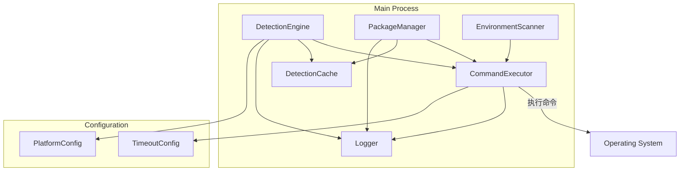
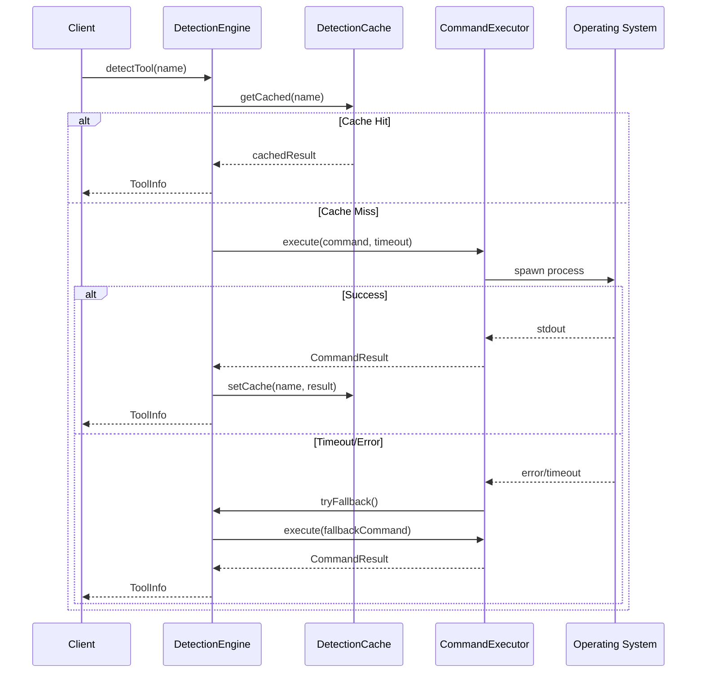

# Design Document: Detection Improvements

## Overview

本设计文档描述了 Dev-Janitor 检测功能改进的技术实现方案。主要改进包括：
- 增加命令执行超时时间并支持配置
- 改进 Windows 平台的命令兼容性
- 优化 npm/pip 输出解析
- 扩展工具检测列表
- 增强错误处理和日志记录
- 添加检测结果缓存

## Architecture

### 系统架构图



### 命令执行流程



## Components and Interfaces

### 1. CommandExecutor 改进

```typescript
// 超时预设配置
export enum TimeoutPreset {
  QUICK = 10000,    // 10 秒 - 简单命令如 --version
  NORMAL = 30000,   // 30 秒 - 默认超时
  SLOW = 60000,     // 60 秒 - 慢命令如 npm list -g
  EXTENDED = 120000 // 120 秒 - 特别慢的命令
}

// 命令类别到超时的映射
export interface TimeoutConfig {
  default: number
  presets: Record<string, number>
}

// 扩展的执行选项
export interface ExtendedExecutorOptions extends ExecutorOptions {
  timeout?: number
  retryCount?: number
  fallbackCommands?: string[]
  logOnError?: boolean
}

// 执行结果扩展
export interface ExtendedCommandResult extends CommandResult {
  executionTime: number
  commandUsed: string
  fallbackUsed?: boolean
}
```

### 2. DetectionEngine 改进

```typescript
// 工具检测配置
export interface ToolDetectionConfig {
  name: string
  displayName: string
  category: ToolInfo['category']
  commands: PlatformCommands
  versionFlag: string
  versionParser?: (output: string) => string | null
}

// 平台特定命令
export interface PlatformCommands {
  win32: string[]
  darwin: string[]
  linux: string[]
}

// Windows 回退路径配置
export interface WindowsFallbackPaths {
  programFiles: string[]
  appData: string[]
  userProfile: string[]
}

// 检测结果扩展
export interface ExtendedToolInfo extends ToolInfo {
  detectionMethod?: 'command' | 'path' | 'fallback'
  detectionTime?: number
  errorReason?: string
}
```

### 3. PackageManager 改进

```typescript
// npm 输出解析器接口
export interface NpmOutputParser {
  parseJson(output: string): PackageInfo[]
  parseText(output: string): PackageInfo[]
  parseWindowsText(output: string): PackageInfo[]
}

// pip 命令缓存
export interface PipCommandCache {
  workingCommand: string | null
  lastChecked: number
  ttl: number
}

// 解析结果
export interface ParseResult {
  packages: PackageInfo[]
  parseMethod: 'json' | 'text' | 'windows-text'
  rawOutput?: string
}
```

### 4. DetectionCache

```typescript
// 缓存条目
export interface CacheEntry<T> {
  data: T
  timestamp: number
  ttl: number
}

// 缓存配置
export interface CacheConfig {
  defaultTTL: number  // 默认 5 分钟
  maxEntries: number  // 最大缓存条目数
}

// 缓存接口
export interface DetectionCache {
  get<T>(key: string): T | null
  set<T>(key: string, value: T, ttl?: number): void
  invalidate(key: string): void
  invalidateAll(): void
  isExpired(key: string): boolean
}
```

## Data Models

### 扩展的工具信息模型

```typescript
export interface ExtendedToolInfo extends ToolInfo {
  // 检测元数据
  detectionMethod: 'command' | 'path-search' | 'fallback'
  detectionTime: number
  commandUsed?: string
  
  // 错误信息
  errorReason?: string
  lastError?: string
  
  // 多版本支持
  allPaths?: string[]
  allVersions?: string[]
}
```

### 日志条目模型

```typescript
export interface DetectionLogEntry {
  timestamp: Date
  toolName: string
  command: string
  success: boolean
  executionTime: number
  exitCode?: number
  stderr?: string
  fallbackUsed?: boolean
}
```

### 检测摘要模型

```typescript
export interface DetectionSummary {
  totalTools: number
  successCount: number
  failureCount: number
  totalTime: number
  failures: Array<{
    toolName: string
    reason: string
  }>
}
```


## Correctness Properties

*A property is a characteristic or behavior that should hold true across all valid executions of a system—essentially, a formal statement about what the system should do. Properties serve as the bridge between human-readable specifications and machine-verifiable correctness guarantees.*

### Property 1: Timeout Configuration Consistency

*For any* timeout value passed to the CommandExecutor, the executor SHALL use that exact timeout value for command execution. When no timeout is specified, the default of 30 seconds SHALL be used.

**Validates: Requirements 1.1**

### Property 2: Command Variant Priority Order

*For any* tool detection on Windows with multiple command variants, the Detection_Engine SHALL try commands in the exact priority order specified in the configuration, stopping at the first successful command.

**Validates: Requirements 2.1**

### Property 3: Parsing Strategy Order

*For any* npm output, the Package_Manager SHALL first attempt JSON parsing. If and only if JSON parsing fails, the text parser SHALL be invoked.

**Validates: Requirements 3.1, 3.2**

### Property 4: Text Parsing Completeness

*For any* valid npm text output containing package entries (with either Unicode tree characters `├──`, `└──` or ASCII alternatives `+--`, `\--`), the parser SHALL extract the correct package name and version.

**Validates: Requirements 3.3, 3.4**

### Property 5: Pip Command Caching

*For any* successful pip command execution, subsequent pip operations SHALL use the cached working command without re-trying failed commands, until the cache expires or is invalidated.

**Validates: Requirements 4.3**

### Property 6: Version Flag Correctness

*For any* tool in the detection list, the Detection_Engine SHALL use the tool-specific version flag (e.g., `--version`, `-version`, `version`) as configured, not a generic flag.

**Validates: Requirements 5.5**

### Property 7: Error Recording Completeness

*For any* failed command execution, the result SHALL contain: the command string, exit code, stderr content, and execution time. *For any* failed tool detection, the ToolInfo SHALL contain an errorReason field describing the failure.

**Validates: Requirements 6.1, 6.2**

### Property 8: Detection Summary Accuracy

*For any* batch tool detection operation, the returned summary SHALL have successCount + failureCount equal to totalTools, and the failures array SHALL contain exactly failureCount entries.

**Validates: Requirements 6.3**

### Property 9: Cache TTL Behavior

*For any* cached detection result, if the current time minus the cache timestamp is less than the TTL, the cached result SHALL be returned. If the time difference exceeds the TTL, a fresh detection SHALL be performed.

**Validates: Requirements 7.1, 7.2**

### Property 10: Cache Control Operations

*For any* force refresh request, the cache SHALL be bypassed and a fresh detection performed. *For any* cache invalidation call, all cached entries SHALL be cleared immediately.

**Validates: Requirements 7.3, 7.4**

## Error Handling

### 命令执行错误

| 错误类型 | 处理策略 | 日志级别 |
|---------|---------|---------|
| 命令超时 | 返回失败结果，记录超时信息 | WARN |
| 命令不存在 | 尝试回退命令或路径搜索 | DEBUG |
| 权限不足 | 返回失败结果，记录权限错误 | ERROR |
| 输出解析失败 | 尝试备用解析器，记录原始输出 | WARN |

### 回退策略

```typescript
// Windows 工具检测回退链
const windowsFallbackChain = {
  python: ['py', 'python', 'python3', /* path search */],
  pip: ['py -m pip', 'pip3', 'pip', /* path search */],
  node: ['node', /* path search in Program Files */],
}

// 路径搜索位置
const windowsSearchPaths = [
  '%ProgramFiles%',
  '%ProgramFiles(x86)%',
  '%LocalAppData%\\Programs',
  '%AppData%',
  '%UserProfile%',
]
```

### 错误恢复

1. **单个工具检测失败**: 记录错误，继续检测其他工具
2. **批量检测部分失败**: 返回成功检测的结果，附带失败摘要
3. **缓存读取失败**: 忽略缓存，执行新检测
4. **解析失败**: 尝试备用解析器，最终返回空列表

## Testing Strategy

### 测试方法

本功能采用双重测试策略：
- **单元测试**: 验证特定示例、边界情况和错误条件
- **属性测试**: 验证跨所有输入的通用属性

### 属性测试配置

- 使用 `fast-check` 库进行属性测试
- 每个属性测试最少运行 100 次迭代
- 每个测试标注对应的设计文档属性

### 测试标签格式

```typescript
// Feature: detection-improvements, Property 1: Timeout Configuration Consistency
test.prop([fc.integer({ min: 1000, max: 120000 })], (timeout) => {
  // test implementation
})
```

### 单元测试覆盖

| 模块 | 测试重点 |
|-----|---------|
| CommandExecutor | 超时处理、错误恢复、日志记录 |
| DetectionEngine | 命令优先级、回退逻辑、缓存行为 |
| PackageManager | JSON/文本解析、命令缓存 |
| DetectionCache | TTL 过期、缓存失效 |

### 边界情况测试

- 超时值为 0 或负数
- 空命令输出
- 畸形 JSON 输出
- 混合 Unicode/ASCII 字符
- 缓存 TTL 边界（刚好过期/未过期）

### 模拟策略

```typescript
// 模拟命令执行
const mockExecutor = {
  execute: jest.fn(),
  executeSafe: jest.fn(),
}

// 模拟文件系统（路径搜索）
jest.mock('fs', () => ({
  existsSync: jest.fn(),
}))

// 模拟平台
jest.spyOn(process, 'platform', 'get').mockReturnValue('win32')
```
