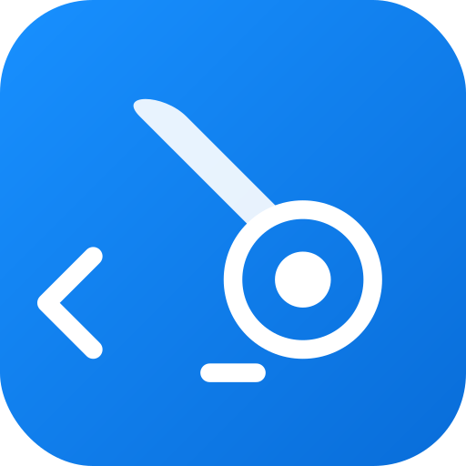

# Dev Janitor 开发清道夫

<p align="center">
  
</p>

<p align="center">
  <strong>跨平台桌面应用程序，帮你清理和管理开发工具与依赖</strong>
</p>

<p align="center">
  <a href="#功能特性">功能特性</a> •
  <a href="#安装">安装</a> •
  <a href="#使用指南">使用指南</a> •
  <a href="#开发">开发</a> •
  <a href="#贡献">贡献</a> •
  <a href="README.md">English</a>
</p>

<p align="center">
  
  
  
  
  
</p>

---

## 概述

Dev Janitor（开发清道夫）是一款功能强大的桌面应用程序，旨在帮助开发者检测、查看和管理系统中的开发工具、依赖包、服务和环境配置。它提供了一个统一的可视化界面，解决版本混乱和管理分散的问题。

## Features

### 🔍 工具检测
- **自动检测**：自动扫描和检测已安装的开发工具
- **36+ 支持的工具**：全面检测包括：
  - **运行时**：Node.js、Python、PHP、Java、Go、Rust、Ruby、.NET、Deno、Bun、Perl、Lua
  - **包管理器**：npm、pip、Composer、Yarn、pnpm、Cargo、RubyGems、Homebrew、Chocolatey、Scoop、winget
  - **云工具**：AWS CLI、Azure CLI、Google Cloud SDK、Helm、Ansible
  - **版本管理器**：nvm、pyenv、rbenv、SDKMAN
  - **开发工具**：Git、Docker、Kubernetes CLI、Terraform
- **版本信息**：显示版本号和安装路径
- **安装状态**：清晰的视觉指示器区分已安装和未安装的工具
- **Windows 兼容**：特别处理 Windows Python 启动器（`py` 命令）
- **可配置超时**：智能超时预设（快速/正常/慢速/扩展）确保可靠检测
- **检测缓存**：5 分钟缓存提升性能，支持强制刷新选项
- **检测摘要**：详细的摘要包含成功/失败计数和耗时信息

### 🤖 AI 助手（新功能！）
- **本地分析**：免费、离线的智能分析，无需 API Key
  - 检测过时的工具版本（基于 Node.js 22 LTS、Python 3.12+ 标准）
  - 发现 PATH 重复项和冲突
  - 识别端口冲突
  - 建议安装缺失的必要工具
- **AI 深度洞察**：可选的 OpenAI 集成，提供更深入的分析
  - 环境健康度评估
  - 个性化优化建议
  - 最佳实践建议（2026 年标准）
- **支持的模型**（2026 年 1 月）：
  - GPT-5（推荐 - 最强编码能力，400K 上下文）
  - GPT-5 Mini / GPT-5 Nano（快速且经济）
  - o3 / o4-mini（推理增强，适合复杂问题）
  - GPT-4.1（上一代稳定版）
- **智能建议**：提供可执行的命令建议
- **多语言**：完整支持中英文

### 📦 包管理
- **NPM 包**：查看和管理全局安装的 npm 包
- **Python 包**：浏览 pip 安装的包
- **Composer 包**：管理 PHP Composer 全局包
- **版本检查**：检测过时的依赖包版本
- **一键更新**：直接在界面中更新包（支持 npm/pip）（新功能！）
- **安全操作**：仅支持查看和复制路径，移除了删除/打开文件等危险操作

### ⚡ 服务监控
- **运行服务**：监控开发服务器和进程
- **端口检测**：识别在特定端口上运行的服务
- **进程控制**：一键停止/终止运行中的服务
- **自动刷新**：每 5 秒自动更新服务列表

### 🌍 环境变量
- **完整扫描**：查看所有系统环境变量
- **PATH 分析**：分析 PATH 条目并检测重复项
- **分类过滤**：按类别过滤变量（PATH、Java、Python、Node 等）
- **问题检测**：高亮显示可能有问题的配置

### 🌐 国际化
- **多语言支持**：英文（en-US）和中文（zh-CN）
- **轻松切换**：在设置中即时切换语言
- **系统检测**：首次启动时自动检测系统语言

### 💻 跨平台
- **Windows**：完全支持 Windows 10/11
- **macOS**：原生支持 macOS 10.15+
- **Linux**：提供 AppImage 和 deb 包

## 截图

<p align="center">
  
  <br>
  <em>Dev Janitor 功能演示</em>
</p>

## 安装

### 下载预构建版本

从 [Releases](https://github.com/cocojojo5213/Dev-Janitor/releases) 页面下载适合您平台的最新版本：

| 平台 | 下载 |
|------|------|
| Windows | `Dev-Janitor-Setup-1.4.0.exe` |
| macOS | `Dev-Janitor-1.4.0.dmg` |
| Linux | `Dev-Janitor-1.4.0.AppImage` |

### 从源码构建

#### 前置要求

- Node.js 18.x 或更高版本
- npm 9.x 或更高版本
- Git

#### 步骤

1. **克隆仓库**
   ```bash
   git clone https://github.com/cocojojo5213/Dev-Janitor.git
   cd Dev-Janitor
   ```

2. **安装依赖**
   ```bash
   npm install
   ```

3. **开发模式运行**
   ```bash
   npm run dev
   ```

4. **为您的平台构建**
   ```bash
   # 为当前平台构建
   npm run build
   
   # 为特定平台构建
   npm run build:win    # Windows
   npm run build:mac    # macOS
   npm run build:linux  # Linux
   ```

## 使用指南

### AI 助手

AI 助手帮助你智能分析和优化开发环境：

1. **打开 AI 助手**：点击右下角的机器人图标
2. **开始分析**：点击"分析环境"按钮
3. **查看结果**：
   - **环境概览**：整体健康状况
   - **发现的问题**：按严重程度分类的问题列表
   - **优化建议**：可执行的改进建议
   - **AI 深度分析**：（需配置 API Key）更详细的洞察
4. **执行建议**：复制提供的命令到终端执行

**配置 AI 增强功能**（可选）：
1. 进入设置页面
2. 配置 OpenAI API Key
3. 启用 AI 功能以获得更智能的分析

### 工具视图

工具视图显示系统上检测到的所有开发工具：

1. **查看工具状态**：查看哪些工具已安装及其版本
2. **刷新检测**：点击刷新按钮重新扫描工具
3. **查看详情**：点击工具卡片查看详细信息
4. **复制路径**：轻松复制安装路径到剪贴板

### 包视图

管理全局安装的包：

1. **切换包管理器**：使用标签页在 npm、pip 和 Composer 之间切换
2. **搜索包**：按名称过滤包
3. **检查更新**：点击"检查所有包的更新"检测过时的包
4. **一键更新**：点击过时包旁边的"更新"按钮直接更新
5. **复制命令**：点击版本标签复制更新命令到剪贴板
6. **刷新列表**：使用刷新按钮更新包列表

### 服务视图

监控和控制运行中的开发服务：

1. **查看运行服务**：查看所有开发进程及其端口
2. **停止服务**：点击停止按钮终止服务
3. **自动刷新**：服务列表每 5 秒自动更新
4. **手动刷新**：点击刷新立即更新

### 环境视图

探索系统的环境配置：

1. **浏览变量**：查看所有环境变量
2. **按类别过滤**：使用类别过滤器缩小结果范围
3. **PATH 分析**：查看详细的 PATH 分解和重复检测
4. **搜索**：按名称或值查找特定变量

### 设置

自定义您的体验：

1. **语言**：在英文和中文之间切换
2. **AI 配置**：配置 OpenAI API Key 以启用 AI 分析
3. **关于**：查看应用程序版本、许可证和联系方式

## 开发

### 技术栈

- **框架**：Electron 33
- **前端**：React 18 + TypeScript
- **UI 库**：Ant Design 5
- **状态管理**：Zustand
- **国际化**：i18next
- **样式**：Tailwind CSS
- **测试**：Vitest + fast-check
- **构建工具**：Vite + electron-builder

### 项目结构

```
dev-janitor/
├── src/
│   ├── main/              # Electron 主进程
│   │   ├── index.ts       # 主入口点
│   │   ├── preload.ts     # 预加载脚本
│   │   ├── ipcHandlers.ts # IPC 处理器
│   │   ├── commandExecutor.ts
│   │   ├── detectionEngine.ts
│   │   ├── packageManager.ts
│   │   ├── serviceMonitor.ts
│   │   ├── environmentScanner.ts
│   │   └── pathScanner.ts
│   ├── renderer/          # React 前端
│   │   ├── components/    # React 组件
│   │   ├── store/         # Zustand store
│   │   ├── i18n/          # 国际化
│   │   └── ipc/           # IPC 客户端
│   └── shared/            # 共享类型
│       └── types/
├── build/                 # 构建资源
├── public/                # 静态资源
└── electron-builder.json5 # 构建配置
```

### 可用脚本

```bash
npm run dev          # 启动开发服务器
npm run build        # 生产构建
npm run build:win    # 为 Windows 构建
npm run build:mac    # 为 macOS 构建
npm run build:linux  # 为 Linux 构建
npm run test         # 运行测试
npm run test:watch   # 监视模式运行测试
npm run lint         # 运行 ESLint
npm run typecheck    # 运行 TypeScript 类型检查
```

### 运行测试

```bash
# 运行所有测试
npm run test

# 监视模式运行测试
npm run test:watch
```

## 贡献

我们欢迎贡献！请按照以下步骤操作：

1. **Fork 仓库**

2. **创建功能分支**
   ```bash
   git checkout -b feature/amazing-feature
   ```

3. **进行更改**
   - 遵循现有的代码风格
   - 为新功能添加测试
   - 根据需要更新文档

4. **提交更改**
   ```bash
   git commit -m '添加一些很棒的功能'
   ```

5. **推送到分支**
   ```bash
   git push origin feature/amazing-feature
   ```

6. **打开 Pull Request**

### 代码风格

- 所有新代码使用 TypeScript
- 遵循项目中配置的 ESLint 规则
- 编写有意义的提交信息
- 为公共 API 添加 JSDoc 注释

### 报告问题

发现 bug 或有功能请求？请[提交 issue](https://github.com/cocojojo5213/Dev-Janitor/issues)，包含：

- 问题或功能的清晰描述
- 重现步骤（针对 bug）
- 预期行为与实际行为
- 系统信息（操作系统、Node.js 版本等）

## 许可证

本项目采用 MIT 许可证 + Commons Clause - 详见 [LICENSE](LICENSE) 文件。

**注意**：这是一个源码可用许可证。你可以自由使用、修改和分发本软件用于个人和非商业用途。未经明确许可，不得进行商业使用（销售软件或基于软件提供收费服务）。

## 联系我们

商业授权咨询或其他问题，请联系：
- 邮箱：cocojojo5213@gmail.com
- 邮箱：cocojojo5213@icloud.com

## 致谢

- [Electron](https://www.electronjs.org/) - 跨平台桌面应用
- [React](https://reactjs.org/) - UI 库
- [Ant Design](https://ant.design/) - UI 组件
- [Zustand](https://github.com/pmndrs/zustand) - 状态管理
- [i18next](https://www.i18next.com/) - 国际化

---

<p align="center">
  由开发者为开发者用 ❤️ 制作
</p>
